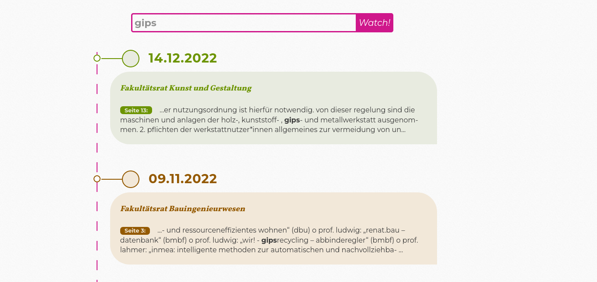

# Bauhaus Watch - Open Source Search Engine for University Committee Protocols

## Introduction

Bauhaus Watch is an open-source search engine specifically designed for indexing and searching protocols of university committees. It provides an efficient and user-friendly way to access and retrieve information from various committee meetings, making it easier for students, lecturers, and administrators to stay informed about the decisions and discussions within the university's governing bodies.

## Features

- [X] **Protocol Indexing**: Bauhaus Watch automatically indexes protocols from university committee sessions, making them easily searchable.

- [X] **Keyword Highlighting**: Bauhaus Watch highlights search keywords within the protocols, helping users identify relevant sections.

- [X] **User-Friendly Interface**: The user interface is designed to be intuitive, allowing users of all levels of technical expertise to navigate and use the search engine effortlessly.

- [X] **Format Independent**: The search functionality does not depend on a specific format of the PDF as long as the text is selectable. Therefore committees do not need to change their protocol template.

- [X] **Autonomous Updates**: Bauhaus Watch fetches new protocols on it's own, making new information available as soon as it is published on the committee website.

- [ ] **Customizable Filters**: Users can apply filters based on committees, dates, or specific topics to narrow down search results.

## Getting Started

There is a test server running at [bauhauswatch.ludattel.info](https://bauhauswatch.ludattel.info)

### Requirements

- Docker

### Installation

1. Clone the repository: `git clone https://github.com/henicosa/BauhausWatch.git`
2. Install and run docker container: `./install.sh`

### Usage

1. Access the search engine through the web browser at `http://localhost:5303`.
2. Enter your search query in the search bar.
3. Click on the page information on a search result to view the full committee protocol.

Because of legal reasons you need to retrieve your own data. The application is designed to be accessed solely from inside the university network. You can turn off this safety measure by setting the variable `development_mode` to `true` in `app.py`.

## Contribution Guidelines

I welcome contributions from the community to improve and enhance Bauhaus Watch. If you would like to contribute, please follow these guidelines:

1. Fork the repository and create your branch: `git checkout -b my-feature`
2. Make changes and commit them: `git commit -m "Add feature"`
3. Push to your branch: `git push origin my-feature`
4. Open a pull request with a detailed description of the changes.

## License

Bauhaus Watch is open-source software licensed under the [MIT License](LICENSE).

## Feedback and Support

If you encounter any issues, have suggestions, or need support, please open an issue on the repository. I appreciate your feedback and am committed to making Bauhaus Watch better with your help!

---

Thank you for using Bauhaus Watch! I hope this search engine will be a valuable resource for accessing university committee protocols and staying informed about the decisions that shape our academic community. Happy searching!
